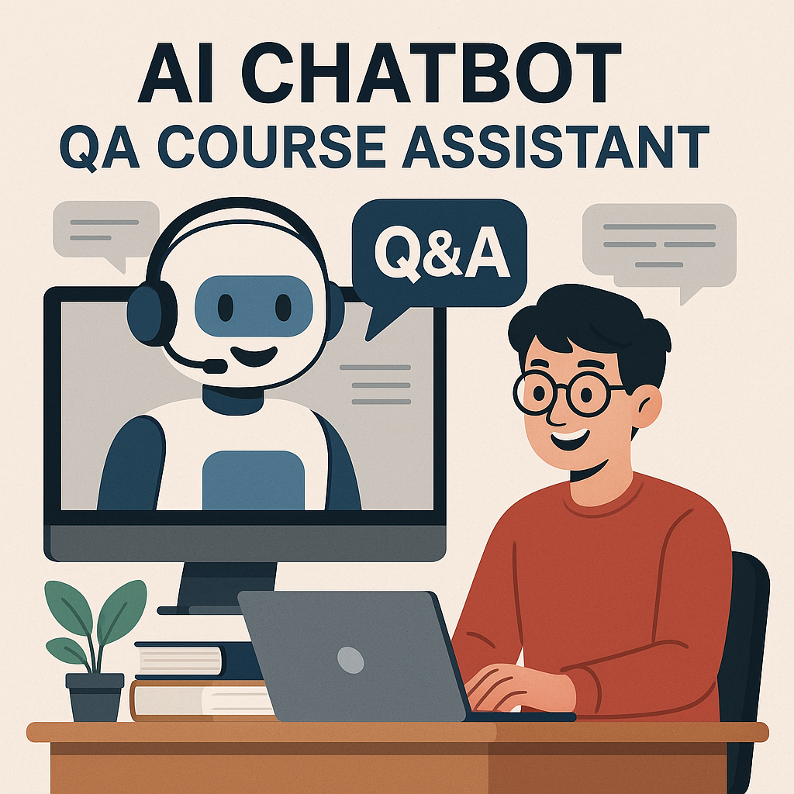

# AI Course assistant

  

## Project overview
This project was completed in the framework of an LLM zoomcamp where the organisers have FAQ google docs documents on three different courses: llm zoomcamp, data engineering zoomcamp and machine learning zoomcamp. THe objective here is to make life easier to student by creation a chatbot that can automatically repond to questions that already exist in the FAQ documents. The students save time and do not need to go through the whole FAQ document to find a single answer.